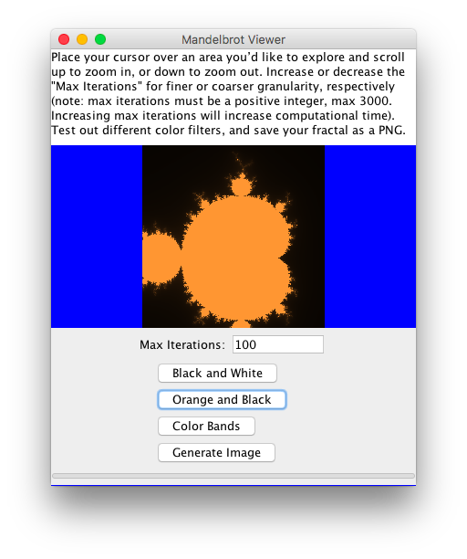

tom # Mandelbrot Viewer

This is a Java Swing application for exploring the Mandelbrot set and printing images.

To use the application, you can either run the executable .jar file `mandelbrotJava.jar` or build and run the project from the Java source code.

More information about the Mandelbrot set can be found [here](https://en.wikipedia.org/wiki/Mandelbrot_set).

## Basic Usage

To use the Mandelbrot viewer, scroll while your mouse is over interesting sections of the fractal image to zoom in and out of those areas.

You may need to adjust max iterations as you zoom in and out of the fractal to achieve an appropriate level of granularity in the image. The higher the max iterations value, the finer the granularity, but values that are too high may cause noticeable performance delays.

## Filters

You can choose from one of three filters: simple black and white, smooth orange and black, and smooth transitioning multicolor.

# Saving Image Files

Once you've found an interesting section of the fractal, click the "Generate Image" button. Depending on the location on the fractal and the value set for max iterations, the image generation will take anywhere from 30 seconds to several minutes to complete.

The output image will be a high-quality 4000x4000 pixel PNG file. The file should open automatically in your computer's default image viewer, and the file will be saved in the same directory as the mandelbrotJava.jar file. The naming convention for the image files is "mandelbrot\_{center.x}\_{center.y}\_{zoom}.png".

